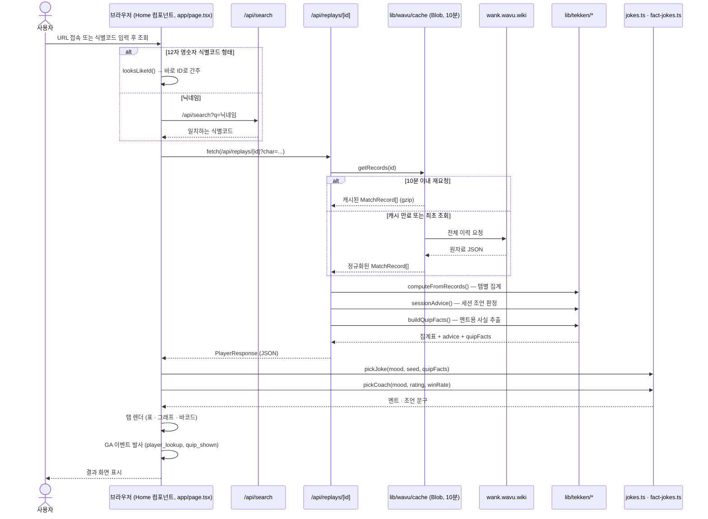

# 조회 한 번의 전체 과정 — 시작점부터 결과 화면까지

[site-structure.md](site-structure.md)가 "무엇이 무엇을 부르는가"(구조)를 그렸다면,
이 문서는 **시간 순서**로 같은 걸 본다 — 사용자가 식별코드를 입력한 순간부터
화면에 통계·멘트가 뜨기까지 실제로 일어나는 일.

## 단계별로 짚을 만한 것

1. **시작점이 두 개다** — URL로 바로 열면(`/player/[id]`) 마운트 시 pathname에서
   식별코드를 읽어 이 흐름이 자동 실행되고, 검색창에서 "조회"를 누르면 클릭이
   트리거다. 그 이후 과정(`run()` 함수, `app/page.tsx`)은 완전히 같다.
2. **닉네임은 식별코드가 아니다** — 12자리 영숫자 형태(`looksLikeId()`)면 검색을
   건너뛰고 바로 식별코드로 취급한다. 아니면 `/api/search`로 먼저 풀어야 한다.
   그마저 여러 명이 걸리면 화면에 칩을 띄우고 멈춘다(사용자가 고를 때까지).
3. **캐시는 Vercel Blob, 10분, gzip** — 한 사람의 전체 이력(수천~수만 경기)을
   매 조회마다 wavu에서 새로 받으면 무겁기도 하고, wavu 문서가 권장하는
   "한 번에 하나씩" 예의에도 어긋난다. 그래서 같은 식별코드는 10분간 재사용한다.
4. **멘트 문구 자체는 서버가 아니라 브라우저에서 고른다** — 서버(`/api/replays/[id]`)
   는 `quipFacts`(마일스톤·승단강등·시각 등 "재료")까지만 계산해서 보내고,
   `pickJoke()`가 실제로 어느 문구를 뽑을지는 클라이언트에서 결정한다
   (`app/jokes.ts`). 그래서 GA `quip_shown` 이벤트도 서버가 아니라 브라우저가
   보낸다 — 실제로 화면에 뜬 걸 세어야 하니까.
5. **결과 화면이 뜬 다음에야 GA 이벤트가 나간다** — `player_lookup`(조회수)과
   `quip_shown`(어느 멘트 풀이 나갔는지)은 렌더가 끝난 뒤, 같은 대상을 두 번
   세지 않도록 가드(`lastLookupRef`)를 거쳐 한 번만 발사된다.
