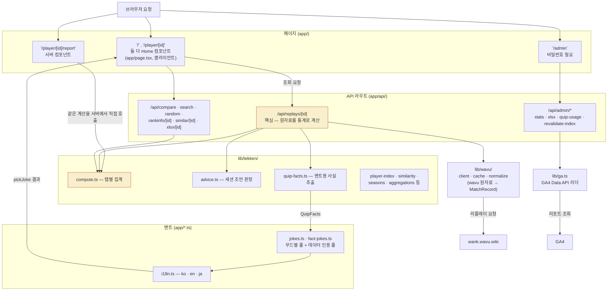

# 사이트 구조 — wavu에서 사용자까지, 그리고 멘트가 스스로를 점검하는 법

핵심 요청 흐름 하나(wavu → Next.js 앱 → 사용자 브라우저) 위에, 2026-08-07에 붙인
멘트 자동 점검 두 개가 GitHub Actions로 매주 돌면서 어디로 연결되는지 그린다.
멘트 점검 자체의 설계 이유는 [quip-monitoring.md](quip-monitoring.md) 참조 — 이 문서는
그게 사이트 전체 구조 안에서 어디에 붙는지만 보여준다. "무엇이 무엇을 부르는가"가
아니라 "조회 한 번이 시간 순서로 어떻게 흘러가는가"가 궁금하면
[request-lifecycle.md](request-lifecycle.md) 참조.

```mermaid
flowchart TB
    wavu["wank.wavu.wiki<br/>철권8 리플레이 API (외부)"]
    app["Next.js 앱 (Vercel)<br/>페이지 · API 라우트 · 멘트 시스템"]
    browser["사용자 브라우저<br/>흐름 탭에서 멘트 · 통계 확인"]
    ga["GA4<br/>player_lookup · quip_shown · 기능 이벤트 14종"]

    wavu -->|리플레이 조회| app
    app -->|렌더된 페이지| browser
    browser -->|이벤트 전송| ga

    subgraph actions["GitHub Actions — 정기 실행 (cron)"]
        direction TB
        card1["player-index-daily<br/>매일 03:10 UTC<br/>신규 ID 리플레이 수집"]
        card2["quip-simulation-check<br/>매주 월 05:30 UTC<br/>레이팅 게이트 회귀 검사"]
        card3["quip-usage-drift-check<br/>매주 월 06:00 UTC<br/>실사용 분포 편중 점검"]
    end

    ga -.->|90일 조회기록| card1
    card1 -->|리플레이 수집| wavu
    card1 -.->|player-index-data.json 표본| card2
    card2 -->|재현| wavu
    ga -.->|quip_shown 집계| card3

    tab["GitHub Actions 탭"]
    admin["/admin 페이지"]

    card1 -->|실행 로그| tab
    card2 -->|실패 시 이메일| tab
    card3 -->|경고만, 이메일 없음| tab
    ga -->|실사용 분포 (quipUsage)| admin

    classDef fail fill:#b95a2422,stroke:#b95a24,color:#b95a24;
    classDef warn fill:#2f7a6822,stroke:#2f7a68,color:#2f7a68;
    classDef checkpoint fill:#b95a2410,stroke:#b95a24,stroke-width:2px;
    class card2 fail;
    class card3 warn;
    class tab,admin checkpoint;
```

## Next.js 앱 내부 구조

위 그림의 "Next.js 앱 (Vercel)" 박스 하나를 확대한 것. 페이지가 API 라우트를
부르고, API 라우트가 `lib/` 계산 계층을 부르고, 그중 `quip-facts.ts`가 뽑아낸
사실을 멘트 시스템(`jokes.ts` 등)이 문구로 바꿔 다시 페이지로 돌아간다.



`/`와 `/player/[id]`는 서로 다른 페이지가 아니다 — 둘 다 같은 `Home` 컴포넌트
(`app/page.tsx`)를 렌더한다. `/player/[id]/page.tsx`는 리다이렉트 없이 그대로
`<Home />`을 반환하고, 공유 링크·검색결과에 이름이 뜨도록 `generateMetadata`만
서버에서 따로 계산한다(주소가 튀지 않게 하려는 설계, 파일 머리말 참조).
`/player/[id]/report`는 반대로 완전히 별도의 서버 컴포넌트라 API 라우트를
거치지 않고 `lib/tekken/`을 직접 호출한다 — 공유 링크·인쇄용으로 완성된
HTML을 내보내야 해서다.

## 세 자동 점검이 하는 일

| 워크플로 | 주기 | 하는 일 | 실패하면 |
|---|---|---|---|
| `player-index-daily` | 매일 03:10 UTC | GA 90일 조회기록에서 신규 ID만 wavu로 수집, `player-index-data.json` 커밋 | 이메일 (기존 시스템, 멘트 점검과 무관) |
| `quip-simulation-check` | 매주 월 05:30 UTC | 레이팅 1950 근방 표본으로 멘트 재현 → 프로/리그 소재가 자격 미달 레이팅에 있으면 실패 | **이메일** — 코드 회귀를 잡는 검사라 실패해야 의미가 있다 |
| `quip-usage-drift-check` | 매주 월 06:00 UTC | GA4 `quip_shown` 집계에서 풀 하나가 60% 넘게 차지하는지 확인 | **실패 안 함** — 로그에 `::warning::`만 남는다, GA 분포 판정은 노이즈가 섞여서다 |

## 확인 지점

- **GitHub Actions 탭** (`Jeremy-Joo/web_game_tekken_stats_wavu` → Actions) — 세 워크플로의 실행 로그 전체. `quip-simulation-check`가 실패하면 GitHub 계정 알림 이메일이 온다(계정 설정은 `github.com/settings/notifications`). `quip-usage-drift-check`는 항상 초록이라 경고를 보려면 로그를 직접 열어야 한다.
- **`/admin` 페이지** — 비밀번호 필요. GA4를 직접 읽어 멘트 풀 분포를 표시한다(사람이 훑어보는 스팟체크용, 자동 판정은 위 워크플로가 한다).

`quip-usage-drift-check`는 GA4 맞춤 측정기준(`quip_pool`, `rating_bucket`) 등록일
(2026-08-07) 기준 14일 유예 기간이 있어 **2026-08-21부터** 실제로 편중을 판정한다.
